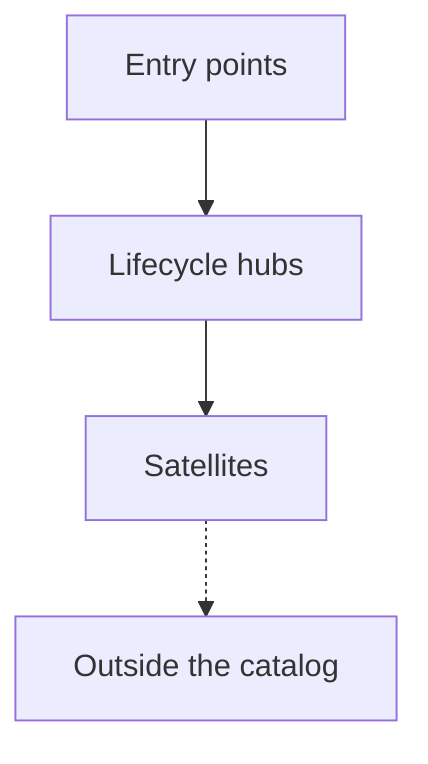

# Skill Graph

<!-- owner: shikanime-labs | zone: internal | purpose: how the catalog's skills layer and depend on each other -->

The catalog is one flat `skills/` directory, but the skills are not flat in
role. Every skill is an entry point, a lifecycle hub, or a satellite, and
every cross-skill arrow is declared in the skill's own `related_skills`
frontmatter (the contract is documented in
[skill-schema.md](skill-schema.md)). This page renders that graph; the
per-skill prose lives in each `SKILL.md`.

## Hierarchy



| Layer | Skills | Role |
| --- | --- | --- |
| Entry points | `cpn-release-patch`, `nixpkgs-pr-review`, `sks-bulk`, `sks-dev-workflow`, `sks-investigate`, `sks-repo`, `sks-triage` | Start a mission: the default dev loop, a bug hunt, a multi-repo sweep, a new repo, a triage sweep, a release backport, an upstream review. |
| Lifecycle hubs | `sks-commit`, `sks-delegate`, `sks-issue-workflow`, `sks-land`, `sks-pr`, `sks-pr-review`, `sks-pr-workflow` | Orchestrate one lifecycle phase and route to the satellites that serve it. |
| Satellites | `sks-adversarial`, `sks-async`, `sks-converge`, `sks-curate`, `sks-discussion`, `sks-discussion-triage`, `sks-doc`, `sks-fastlane`, `sks-gc`, `sks-issue`, `sks-issue-refine`, `sks-issue-triage`, `sks-nix-authoring`, `sks-pr-resolve`, `sks-pr-triage`, `sks-restack`, `sks-skill-authoring`, `sks-sops-secrets-authoring`, `sks-swarm`, `sks-update` | One concern inside a hub's flow: triage, resolve, fan out, restack, reclaim, author. |
| Outside the catalog | `caveman-compress`, `caveman-review`, `github-code-review`, `github-workflow-generation`, `ponytail-audit`, `ponytail-review`, `requesting-code-review` | Hermes built-ins (`requesting-code-review`, `github-*`) and established library skills (`caveman-*`, `ponytail-*`) referenced but not shipped here. |

`sks-dev-workflow` is the meta-hub: it is the recommended front door for
normal work, and every hub lists it so any entry re-enters the same loop.

## Entry point views

One graph per entry point, direct hand-offs only — the transitive
closure is the dependency-flow table below.

### `sks-dev-workflow`

```mermaid
flowchart TD
    sks_dev_workflow["sks-dev-workflow"]
    ponytail_review(["ponytail-review"])
    sks_dev_workflow -.-> ponytail_review
    sks_async["sks-async"]
    sks_dev_workflow --> sks_async
    sks_commit["sks-commit"]
    sks_dev_workflow --> sks_commit
    sks_delegate["sks-delegate"]
    sks_dev_workflow --> sks_delegate
    sks_land["sks-land"]
    sks_dev_workflow --> sks_land
    sks_pr["sks-pr"]
    sks_dev_workflow --> sks_pr
    sks_pr_review["sks-pr-review"]
    sks_dev_workflow --> sks_pr_review
    sks_swarm["sks-swarm"]
    sks_dev_workflow --> sks_swarm
```### `sks-investigate`

```mermaid
flowchart TD
    sks_investigate["sks-investigate"]
    ponytail_audit(["ponytail-audit"])
    sks_investigate -.-> ponytail_audit
    sks_async["sks-async"]
    sks_investigate --> sks_async
    sks_delegate["sks-delegate"]
    sks_investigate --> sks_delegate
    sks_dev_workflow["sks-dev-workflow"]
    sks_investigate --> sks_dev_workflow
    sks_issue["sks-issue"]
    sks_investigate --> sks_issue
    sks_pr_review["sks-pr-review"]
    sks_investigate --> sks_pr_review
```### `sks-bulk`

```mermaid
flowchart TD
    sks_bulk["sks-bulk"]
    sks_commit["sks-commit"]
    sks_bulk --> sks_commit
    sks_delegate["sks-delegate"]
    sks_bulk --> sks_delegate
    sks_dev_workflow["sks-dev-workflow"]
    sks_bulk --> sks_dev_workflow
    sks_issue_workflow["sks-issue-workflow"]
    sks_bulk --> sks_issue_workflow
    sks_pr_workflow["sks-pr-workflow"]
    sks_bulk --> sks_pr_workflow
```### `sks-repo`

```mermaid
flowchart TD
    sks_repo["sks-repo"]
    github_workflow_generation(["github-workflow-generation"])
    sks_repo -.-> github_workflow_generation
    sks_dev_workflow["sks-dev-workflow"]
    sks_repo --> sks_dev_workflow
```### `sks-triage`

```mermaid
flowchart TD
    sks_triage["sks-triage"]
    sks_bulk["sks-bulk"]
    sks_triage --> sks_bulk
    sks_discussion_triage["sks-discussion-triage"]
    sks_triage --> sks_discussion_triage
    sks_issue_triage["sks-issue-triage"]
    sks_triage --> sks_issue_triage
    sks_issue_workflow["sks-issue-workflow"]
    sks_triage --> sks_issue_workflow
    sks_pr_triage["sks-pr-triage"]
    sks_triage --> sks_pr_triage
    sks_pr_workflow["sks-pr-workflow"]
    sks_triage --> sks_pr_workflow
```### `cpn-release-patch`

```mermaid
flowchart TD
    cpn_release_patch["cpn-release-patch"]
    sks_commit["sks-commit"]
    cpn_release_patch --> sks_commit
    sks_dev_workflow["sks-dev-workflow"]
    cpn_release_patch --> sks_dev_workflow
    sks_pr["sks-pr"]
    cpn_release_patch --> sks_pr
```### `nixpkgs-pr-review`

```mermaid
flowchart TD
    nixpkgs_pr_review["nixpkgs-pr-review"]
    github_code_review(["github-code-review"])
    nixpkgs_pr_review -.-> github_code_review
    sks_pr_review["sks-pr-review"]
    nixpkgs_pr_review --> sks_pr_review
```

## Dependency flow

Cross-phase hand-offs, counted per declared edge. Every edge is declared in
the skill's own `related_skills`; the views above show it per entry point.

| From | Hands off to |
| --- | --- |
| Entry points | Branch and commit (6), Issues (5), Land (1), Pull requests (8), Scale out (3), Outside the catalog (4) |
| Issues | Entry points (2), Land (1), Pull requests (2) |
| Branch and commit | Entry points (4), Pull requests (6), Repair (1), Scale out (1) |
| Pull requests | Branch and commit (1), Entry points (2), Issues (4), Land (4), Outside the catalog (3) |
| Land | Branch and commit (2), Issues (2), Pull requests (4) |
| Scale out | Branch and commit (1), Entry points (3), Pull requests (2), Repair (2) |
| Repair | Branch and commit (2), Entry points (3), Land (1), Scale out (2) |
| Catalog maintenance | Branch and commit (3), Entry points (3), Land (1), Pull requests (3), Scale out (1), Outside the catalog (3) |

## Refreshing this page

The diagrams and tables are generated, not hand-drawn. After adding or
rewiring a skill, re-extract the edges and update the blocks above:

```python
import re, pathlib
for d in sorted(pathlib.Path('skills').rglob('SKILL.md')):
    fm = d.read_text().split('---')[1]
    m = re.search(r'related_skills:\n((?:\s+- .+\n)+)', fm)
    print(d.parent.name,
          [x.strip('- ').strip() for x in m.group(1).splitlines()] if m else [])
```
