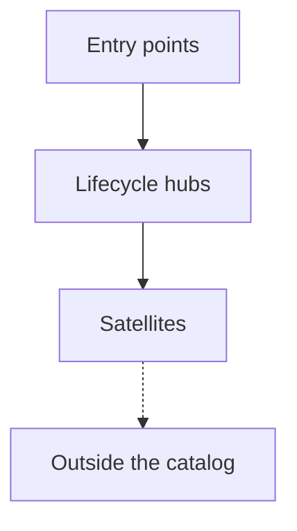

# Skill Graph

<!-- owner: shikanime-labs | zone: internal | purpose: how the catalog's skills layer and depend on each other -->

The catalog is one flat `skills/` directory, but the skills are not flat in
role. Every skill is an entry point, a lifecycle hub, or a satellite, and
every cross-skill arrow is declared in the skill's own `related_skills`
frontmatter. This page renders that graph; the per-skill prose lives in each
`SKILL.md`.

## Hierarchy



| Layer | Skills | Role |
| --- | --- | --- |
| Entry points | `sks-dev-workflow`, `sks-investigate`, `sks-bulk`, `sks-repo`, `cpn-release-patch`, `nixpkgs-pr-review` | Start a mission: the default dev loop, a bug hunt, a multi-repo sweep, a new repo, a release backport, an upstream review. |
| Lifecycle hubs | `sks-issue-workflow`, `sks-delegate`, `sks-commit`, `sks-pr-workflow`, `sks-pr`, `sks-pr-review`, `sks-land` | Orchestrate one lifecycle phase and route to the satellites that serve it. |
| Satellites | `sks-issue`, `sks-issue-refine`, `sks-issue-triage`, `sks-discussion-triage`, `sks-doc`, `sks-pr-triage`, `sks-pr-resolve`, `sks-fastlane`, `sks-async`, `sks-swarm`, `sks-adversarial`, `sks-converge`, `sks-restack`, `sks-gc`, `sks-update`, `sks-curate`, `sks-skill-authoring`, `sks-nix-authoring`, `sks-sops-secrets-authoring` | One concern inside a hub's flow: triage, resolve, fan out, restack, reclaim, author. |
| Outside the catalog | `caveman-compress`, `caveman-review`, `ponytail-review`, `ponytail-audit`, `requesting-code-review`, `github-code-review`, `github-workflow-generation` | Referenced families maintained in other repos; the catalog depends on them but does not ship them. |

`sks-dev-workflow` is the meta-hub: it is the recommended front door for
normal work, and every hub lists it so any entry re-enters the same loop.

## Dependency flow

Cross-phase hand-offs, counted per declared edge; the per-skill breakdown
follows in the adjacency table.

| From | Hands off to |
| --- | --- |
| Entry points | Branch and commit (6), Issues (2), Land (1), Pull requests (6), Scale out (3), Outside the catalog (4) |
| Issues | Entry points (2), Land (1), Pull requests (2) |
| Branch and commit | Entry points (4), Pull requests (6), Repair (1), Scale out (1) |
| Pull requests | Branch and commit (1), Entry points (2), Issues (4), Land (4), Outside the catalog (3) |
| Land | Branch and commit (2), Issues (2), Pull requests (4) |
| Scale out | Branch and commit (1), Entry points (3), Pull requests (2), Repair (2) |
| Repair | Branch and commit (2), Entry points (3), Land (1), Scale out (2) |
| Catalog maintenance | Branch and commit (3), Entry points (3), Land (1), Pull requests (3), Scale out (1), Outside the catalog (3) |

## Per-skill adjacency

The complete declared edges, one row per skill, in `related_skills` order.

| Skill | Hands off to |
| --- | --- |
| `cpn-release-patch` | `sks-dev-workflow`, `sks-pr`, `sks-commit` |
| `nixpkgs-pr-review` | `sks-pr-review`, `github-code-review` |
| `sks-adversarial` | `sks-delegate`, `sks-async`, `sks-investigate`, `sks-pr-review`, `sks-gc` |
| `sks-async` | `sks-dev-workflow`, `sks-pr` |
| `sks-bulk` | `sks-commit`, `sks-delegate`, `sks-dev-workflow`, `sks-issue-workflow`, `sks-pr-workflow` |
| `sks-commit` | `sks-pr-review`, `sks-dev-workflow`, `sks-pr` |
| `sks-converge` | `sks-restack`, `sks-dev-workflow`, `sks-delegate`, `sks-gc` |
| `sks-curate` | `sks-update`, `sks-skill-authoring`, `sks-dev-workflow`, `sks-pr-review`, `caveman-compress`, `ponytail-review`, `ponytail-audit` |
| `sks-delegate` | `sks-dev-workflow`, `sks-async`, `sks-commit`, `sks-pr-workflow`, `sks-gc` |
| `sks-dev-workflow` | `sks-pr-review`, `sks-async`, `sks-delegate`, `sks-swarm`, `sks-commit`, `sks-pr`, `sks-land`, `ponytail-review` |
| `sks-discussion` | `sks-discussion-triage`, `sks-issue`, `sks-issue-workflow` |
| `sks-discussion-triage` | `sks-discussion`, `sks-issue` |
| `sks-doc` | `sks-pr`, `sks-land`, `sks-issue` |
| `sks-fastlane` | `sks-land`, `sks-pr-workflow`, `sks-commit`, `sks-delegate` |
| `sks-gc` | `sks-async`, `sks-dev-workflow`, `sks-land` |
| `sks-investigate` | `sks-pr-review`, `sks-async`, `sks-delegate`, `sks-issue`, `sks-dev-workflow`, `ponytail-audit` |
| `sks-issue` | `sks-doc`, `sks-issue-refine`, `sks-pr` |
| `sks-issue-refine` | `sks-issue`, `sks-issue-workflow`, `sks-issue-triage`, `sks-investigate` |
| `sks-issue-triage` | `sks-issue`, `sks-issue-workflow`, `sks-investigate` |
| `sks-issue-workflow` | `sks-issue`, `sks-issue-refine`, `sks-issue-triage` |
| `sks-land` | `sks-pr-resolve`, `sks-pr`, `sks-issue`, `sks-pr-review`, `sks-doc` |
| `sks-nix-authoring` | `sks-delegate`, `sks-commit`, `sks-dev-workflow`, `sks-pr-review` |
| `sks-pr` | `sks-commit`, `sks-pr-resolve`, `sks-land`, `sks-pr-workflow`, `sks-doc` |
| `sks-pr-resolve` | `sks-pr-review`, `sks-pr`, `sks-land`, `sks-doc`, `sks-issue`, `sks-investigate` |
| `sks-pr-review` | `sks-pr-resolve`, `sks-land`, `sks-pr`, `requesting-code-review`, `caveman-review`, `ponytail-review` |
| `sks-pr-triage` | `sks-pr`, `sks-pr-workflow`, `sks-investigate` |
| `sks-pr-workflow` | `sks-pr`, `sks-pr-triage`, `sks-land`, `sks-pr-resolve`, `sks-issue-workflow` |
| `sks-repo` | `sks-dev-workflow`, `github-workflow-generation` |
| `sks-restack` | `sks-converge`, `sks-dev-workflow`, `sks-delegate`, `sks-async`, `sks-gc` |
| `sks-skill-authoring` | `sks-curate`, `sks-update`, `sks-dev-workflow`, `sks-adversarial`, `sks-commit`, `sks-pr-workflow` |
| `sks-sops-secrets-authoring` | `sks-commit`, `sks-dev-workflow`, `sks-pr`, `sks-pr-review`, `sks-delegate` |
| `sks-swarm` | `sks-adversarial`, `sks-async`, `sks-investigate`, `sks-gc` |
| `sks-update` | `sks-curate`, `sks-dev-workflow`, `sks-delegate`, `sks-commit`, `sks-pr-workflow`, `sks-land` |

## Refreshing this page

The diagram and table are generated, not hand-drawn. After adding or
rewiring a skill, re-extract the edges and update the blocks above:

```python
import re, pathlib
for d in sorted(pathlib.Path('skills').rglob('SKILL.md')):
    fm = d.read_text().split('---')[1]
    m = re.search(r'related_skills:\n((?:\s+- .+\n)+)', fm)
    print(d.parent.name,
          [x.strip('- ').strip() for x in m.group(1).splitlines()] if m else [])
```
