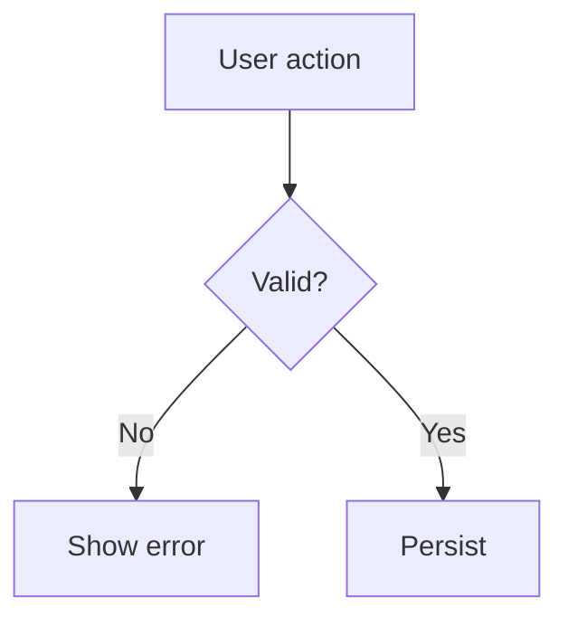

# GitHub Issue Metadata Workflow

## Body discipline

The issue body carries **only relevant information** — narrative, context,
reproduction steps, acceptance criteria. It must NOT duplicate structured
metadata. Type, priority, assignee, labels, project, and parent/child
relationship all live in fields, not prose.

## Body structure

GitHub renders Mermaid natively in issues — wrap diagrams in ` ```mermaid ` fences (no plugins, no images). Enforce structure over prose walls:

- **Markdown headings** (`##`) separate concerns: `## Context`, `## Current behavior`, `## Impact`, `## Steps to reproduce`, `## Acceptance criteria`. No giant paragraphs.
- **`flowchart`** for logic, control flow, or component interaction.
- **`sequenceDiagram`** for request/response or multi-actor flows.
- **`gitGraph`** for branch/merge or parent-child relationship visuals.
- Reference related work by number (`#123`), never by `@handle` or prose.



Pitfalls (GitHub's mermaid engine):
- Emoji and some extended-ASCII chars break rendering — avoid in labels; use HTML entities if unavoidable.
- Hyperlinks / tooltips / `click` interactions do NOT work on GitHub — describe links in text.
- Quote labels containing `()` / `[]` / special chars: `A["Text (note)"]`.

Full constraint list and real-world examples: `references/mermaid-in-github-issues.md`.

## Full-set creation procedure

Set every available field at creation; fill custom fields and the relationship
immediately after. Never leave an issue half-configured.

```bash
# 1. Create — body holds only relevant content
gh issue create --repo OWNER/REPO \
  --title "..." \
  --body-file body.md \
  --label "LABEL1" --label "LABEL2" \
  --assignee "@me" \
  --project "Project Title"

# 2. Set custom fields (type, priority) — single-select needs field + option node IDs
PROJECT_ID=$(gh project view <PROJECT_NUMBER> --owner OWNER --format json -q .id)
ITEM_ID=$(gh project item-list <PROJECT_NUMBER> --owner OWNER --format json \
  -q --arg n "$ISSUE_NUM" '.items[] | select(.content.number==($n|tonumber)) | .id')
# Inspect fields/options to get the IDs:
gh project field-list <PROJECT_NUMBER> --owner OWNER --format json
gh project item-edit --id "$ITEM_ID" --project-id "$PROJECT_ID" \
  --field-id "$TYPE_FIELD_ID" --single-select-option-id "$TYPE_OPTION_ID"
gh project item-edit --id "$ITEM_ID" --project-id "$PROJECT_ID" \
  --field-id "$PRIORITY_FIELD_ID" --single-select-option-id "$PRIORITY_OPTION_ID"

# 3. Parent/child relationship — see "Sub-issue linking pattern" below
```

## Defaults when not specified

Apply these so no field is ever left empty:

- **assignee**: `@me`
- **type**: `new feature`
- **priority**: `medium`
- **project**: the repo's default board

## Sub-issue linking pattern

GitHub Projects v2 `addSubIssue` input uses `issueId` (parent) and `subIssueId` (child), not `parentIssueId`.

```bash
PARENT_ID=$(gh issue view PARENT_NUM --repo OWNER/REPO --json id -q .id)
CHILD_ID=$(gh issue view CHILD_NUM --repo OWNER/REPO --json id -q .id)

gh api graphql -f query='
mutation($parentIssueId: ID!, $subIssueId: ID!, $replaceParent: Boolean!) {
  addSubIssue(input: {issueId: $parentIssueId, subIssueId: $subIssueId, replaceParent: $replaceParent}) {
    issue { id number title }
  }
}
' -F parentIssueId="$PARENT_ID" -F subIssueId="$CHILD_ID" -F replaceParent=true
```

## Project field queries

For Projects v2 field introspection, use REST endpoint:
```bash
# Project fields via REST (org-level projects)
gh api repos/OWNER/REPO/projects/PROJECT_NUMBER/fields

# Or GraphQL __type introspection for mutation inputs
gh api graphql -f query='query { __type(name: "AddSubIssueInput") { inputFields { name type { name } } } }'
```

## Token scopes required

- `read:project` — list projects
- `project` — add items to projects, create/update fields
- `repo` — standard issue/PR operations

```bash
gh auth refresh -s read:project -s project
```

## Pitfalls

- `addProjectV2ItemById` requires `project` scope, not just `read:project`
- `--add-project` flag uses project **title**, not number
- Sub-issue field is `subIssueId`, not `parentIssueId` on the child
- `replaceParent: true` prevents errors if a sub-issue already has a parent
- Board `type` and `priority` are custom fields; they **may not be returned or settable** with the same schema. Use `gh project field-list` to confirm they exist. If missing, set them manually in the web UI.
