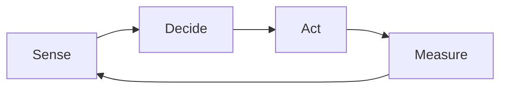

# Self-Evolution Loop

A closed loop the agent runs over its own substrate — every artifact that
steers its future behavior: skills, profiles, memory, agent conventions
(`AGENTS.md`), cron jobs, agent harness configs, and configuration — so the
substrate improves itself instead of waiting for a human to name the target.
Profiles evolve alongside skills under the same loop; memory, conventions,
harness, and config evolve under it too, by their own update rules.

Three inspirations shape the design. Darwinian evolution and Paperclip:
every cycle generates variation, applies selection, and the winners shape the
next generation. Open manufacturing (Yang & Johansen 2010) adds the
self-accumulation role — accumulating, absorbing, and creating knowledge for
future operations — and its open-system stance: capability grows through
internal self-accumulation AND external absorption (upstream catalogs, OSS,
papers), not mutation of internals alone.

## When to Use

- "Evolve yourself / improve the catalog based on what you learned."
- Recurring friction was re-solved manually more than once.
- A skill drifted from how work is actually done.
- Profile-level pain has no owner (token waste, stale persona, dead cron).
- NOT for a named, one-off fix — run `sks-curate` / `sks-update` directly.

## The loop



1. **Sense** — mine recorded experience for evolution signals: memory
   entries, session history, correction traces, repeated pitfalls, token-cost
   observations, eval failures. Signals are the mutation source. Read-only:
   never edit memories or sessions to make a signal go away.
2. **Decide** — select the next evolution autonomously. One signal maps to
   one action: author a new skill (`sks-skill-authoring`), curate an existing
   skill or profile (`sks-curate`), run a batch catalog/profile refresh
   (`sks-update`), author a profile distribution (`sks-curate`),
   update memory, conventions (`AGENTS.md`), cron, harness, or config by
   their own update rules, or fan out independent targets (`sks-delegate`,
   `sks-async`, `sks-swarm`).
   Token efficiency is a first-class selection pressure: a change is worth
   landing only when it measurably reduces load cost or failure rate.
3. **Act** — execute through the delegated skill; never hand-write the
   product here. Absorb externals where they beat internals (an upstream fix,
   a paper's model). Each candidate change is one variation.
4. **Measure** — score fitness: token cost delta, failure-rate delta, eval
   deltas. Selection keeps what measurably improved; the fitness results
   re-rank the signal backlog for the next cycle.

## Procedure (one cycle = one PR)

1. **Harvest signals** — sweep memory and recent sessions; list each signal
   with its evidence (what recurred, how often, what it cost).
2. **Rank by expected fitness gain** — frequency x cost of the friction vs.
   size of the change. Take the top of the backlog.
3. **Pick the action** per the Decide mapping; open the issue
   (`sks-issue`) unless one exists.
4. **Execute** through the delegated skill in a fresh jj workspace
   (`sks-delegate`); fan out only when targets are provably independent.
5. **Record fitness** — measure before/after (line/token counts of the
   changed skill, eval pass rate, failure recurrence) and post the numbers as
   an issue comment. The numbers, not the intent, decide keep vs. revert.
6. **Hand off** to `sks-pr`. Stop: the loop never merges.

## Pitfalls

- **The loop gates itself, not the landing.** It selects, executes, and
  measures; the human merges. Never self-merge, never chain cycles past a PR.
- **Signals are read-only.** Mining memory/session history never mutates it;
  fixing the signal's cause happens in the substrate (skill/profile), not the
  record.
- **One cycle, one PR, one substrate area.** A cycle that touches skills AND
  profiles AND memory tooling is three cycles. Split it.
- **Fitness is measured, not asserted.** "Tightened the skill" is not
  fitness; "-38% SKILL.md tokens, evals 4/4" is. Revert when numbers disagree.
- **Fan-out is not default.** Independent targets only (`sks-async`);
  interdependent targets go in one cycle, sequenced.
- **Token efficiency cuts both ways.** Evolving must not cost more than it
  saves; skip a cycle whose harvest exceeds its expected gain.

## Verification

```bash
test -f skills/sks-evolve/SKILL.md
python3 -c "import json;json.load(open('skills/sks-evolve/evals/evals.json'))"
grep -q sks-evolve README.md && grep -q sks-evolve skills.json
```

A cycle is complete when its PR carries measured before/after fitness numbers
and the issue ledger is discharged N of N.

## See also

- `sks-update` / `sks-curate` — the batch shell and the rework pass; both
  cover profiles alongside skills.
- `sks-skill-authoring` — skill authoring; profiles are authored and curated
  through `sks-curate`.
- `sks-delegate` / `sks-async` / `sks-swarm` — divide-and-conquer fan-out.
